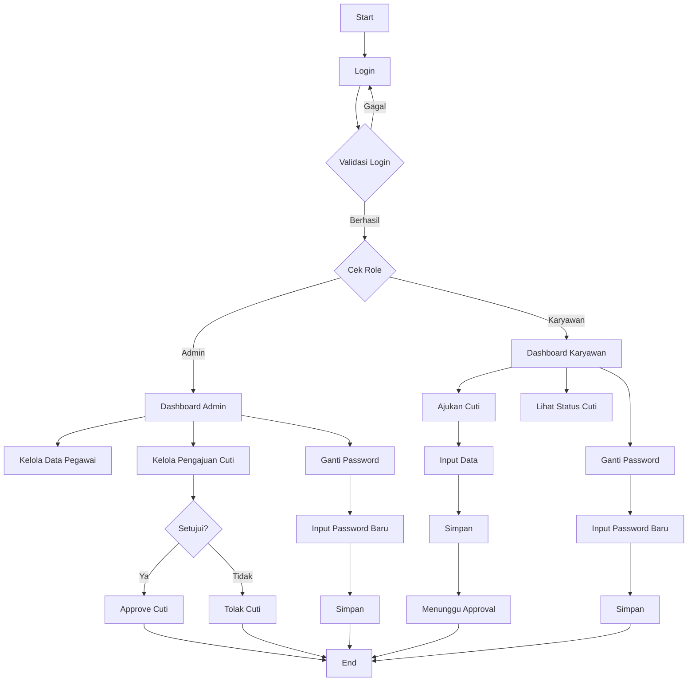

# 📌 Sistem Pengajuan Cuti Karyawan Nusantara Digital

Aplikasi berbasis web yang dirancang untuk mempermudah proses pengajuan dan pengelolaan cuti karyawan. Sistem ini mencakup fitur autentikasi pengguna, pengajuan cuti, persetujuan oleh admin, serta pengelolaan data pegawai secara terpusat.

---

## 🚀 Fitur Utama

* Login Admin & Karyawan
* Pengajuan Cuti
* Approval / Penolakan Cuti (Admin)
* Manajemen Data Pegawai
* Laporan Cuti
* Ganti Password (Admin & Karyawan)

---

## 👥 Role Pengguna

### **Admin**

* Mengelola data pegawai
* Mengelola pengajuan cuti
* Menyetujui atau menolak cuti
* Melihat laporan cuti
* Mengganti password

### **Karyawan**

* Mengajukan cuti
* Melihat status pengajuan cuti
* Melihat riwayat cuti
* Mengganti password

---

## 🔄 Flowchart Sistem

---

## 🛠️ Teknologi yang Digunakan

* PHP Native
* MySQL
* HTML, CSS, JavaScript
* Bootstrap (Opsional)

---

## ⚙️ Cara Menjalankan

1. Clone repository ini
2. Import database ke phpMyAdmin
3. Atur koneksi database pada file `koneksi.php`
4. Jalankan aplikasi melalui localhost atau hosting

---

## 🌐 Deployment

Aplikasi dapat dijalankan pada:

* Localhost (XAMPP, Laragon, dll)
* Hosting gratis seperti InfinityFree
* Hosting berbayar / VPS

---

## 🌐 Live Demo

🚀 Aplikasi dapat diakses secara online:

🔗 **http://cutinusantaradigital.infinityfree.me/**

Silakan login menggunakan akun yang tersedia untuk mencoba fitur sistem.

## 🔑 Akun Testing

*Admin
- Username: admin
- Password: admin

*Karyawan
- Username: 12345678
- Password: 123456

---

## ⚠️ Catatan
* Approval hanya bisa dilakukan oleh Admin
* Sisa cuti berkurang otomatis sesuai lama cuti
* Pengurangan cuti saat admin klik Proses Cuti

---

## ✨ Catatan

Pastikan konfigurasi database dan koneksi sudah sesuai agar aplikasi dapat berjalan dengan baik tanpa error.

---

## 👨‍💻 Author

Dibuat oleh: **Fatmah Rohmah Tika**
