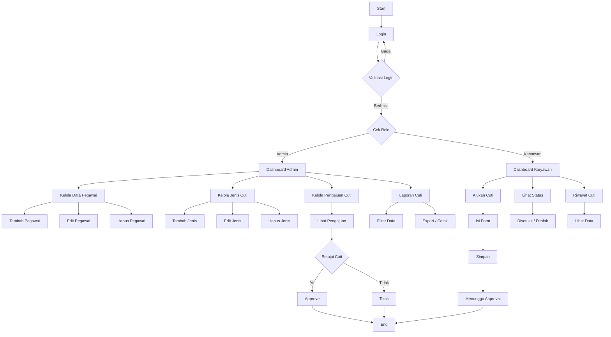

# SISTEM CUTI KARYAWAN NUSANTARA DIGITAL - SIAP JALAN

## 📌 Cara Menjalankan

1. Extract folder project ke:
   - `htdocs` (XAMPP)
   - `www` (Laragon/WAMP)
   - atau folder server lokal lainnya

2. Buat / Import Database:
   - File: `dbcuti_ready.sql`
   - Nama database: `dbcuti`

3. Setting koneksi database di:
   function/koneksi.php
   - Default:
   - Host : localhost
   - User : root
   - Password : (kosong)
   - Database : dbcuti

4. Jalankan di browser:
   http://localhost/cutiatm_nusantara_digital/cutiatm_final/

---

## 🔑 Akun Testing

### 👨‍💼 Admin
- Username: `admin`
- Password: `admin`

### 👨‍🔧 Karyawan
- Username: `000111`
- Password: `123456`

- Username: `111000`
- Password: `654321`

---

## ✅ Perbaikan yang Sudah Dilakukan

1. Approval cuti hanya bisa dilakukan oleh **Admin**.
2. Halaman **Cek Pengajuan** dibuat **read-only** (tidak ada tombol approve/tolak).
3. Proses cuti hanya mengambil data dengan status:
- `Approve`
- `Success`
4. Pengurangan sisa cuti:
- Otomatis sesuai **lama cuti**
- Bukan lagi dikurangi 1
5. Menu **Jadwal Cuti**:
- Menampilkan karyawan yang cutinya sudah disetujui/diproses
6. Menu **Sisa Cuti**:
- Menampilkan sisa cuti real dari database
7. Penambahan jenis cuti:
- Cuti Tahunan
- Cuti Melahirkan
8. Tampilan UI:
- Lebih lega
- Responsive
- Tabel bisa scroll di layar kecil
9. File print laporan:
- Sudah diperbaiki agar tidak error

---

## 🔄 Flowchart Sistem (Detail)

---

## ⚠️ Catatan Penting

- Pengurangan sisa cuti terjadi saat:
  👉 Admin klik tombol **Proses** di menu **Proses Cuti**

---

## 🚀 Status Project

✅ Siap dijalankan  
✅ Sudah diperbaiki bug utama  
✅ Cocok untuk demo / tugas / implementasi awal  

---
